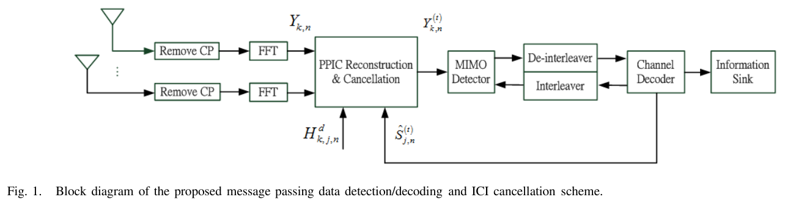
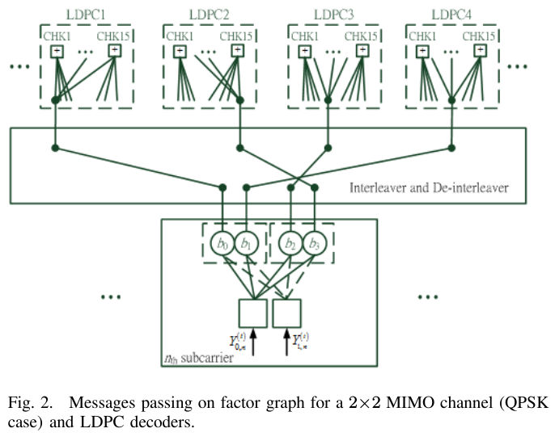
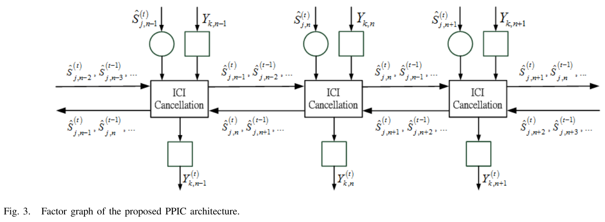
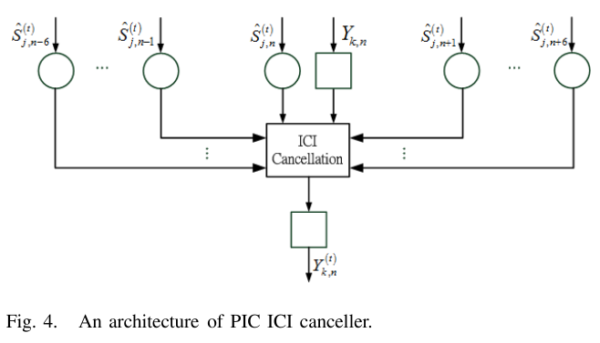
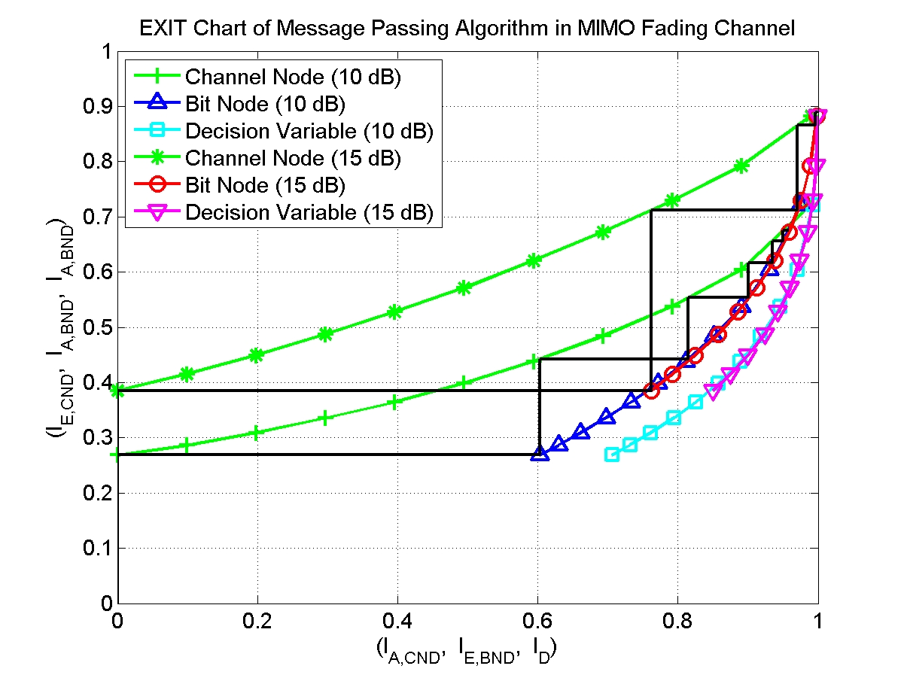
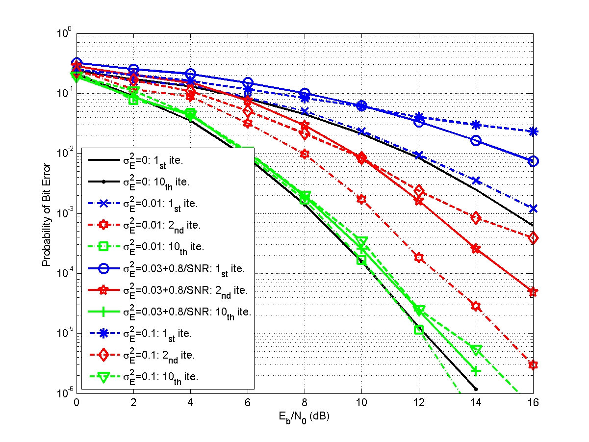
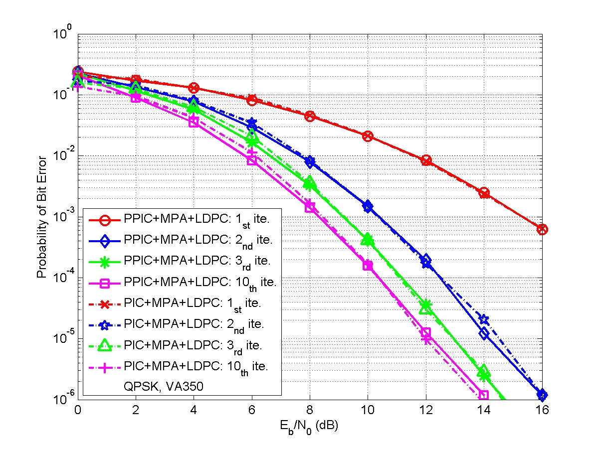
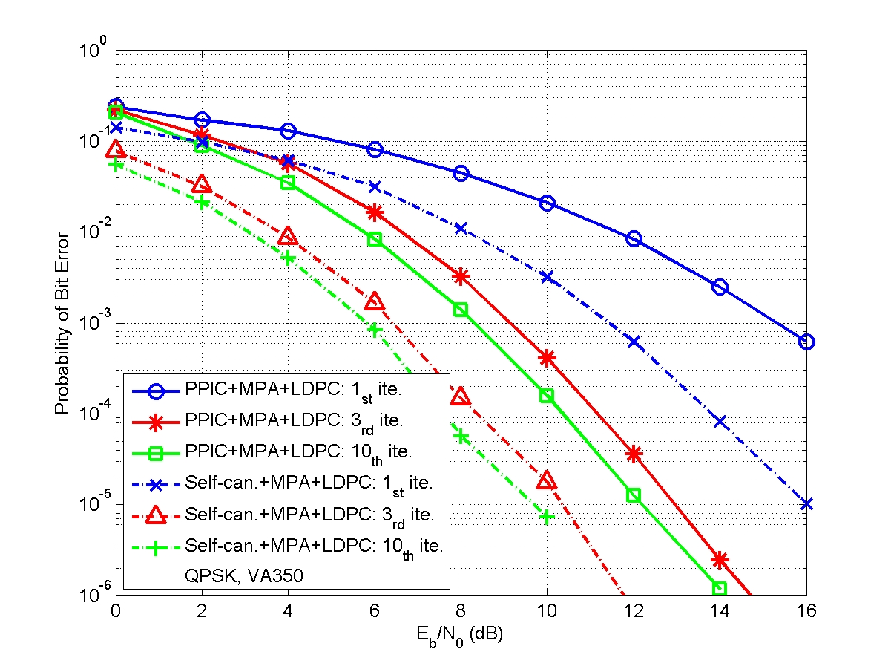
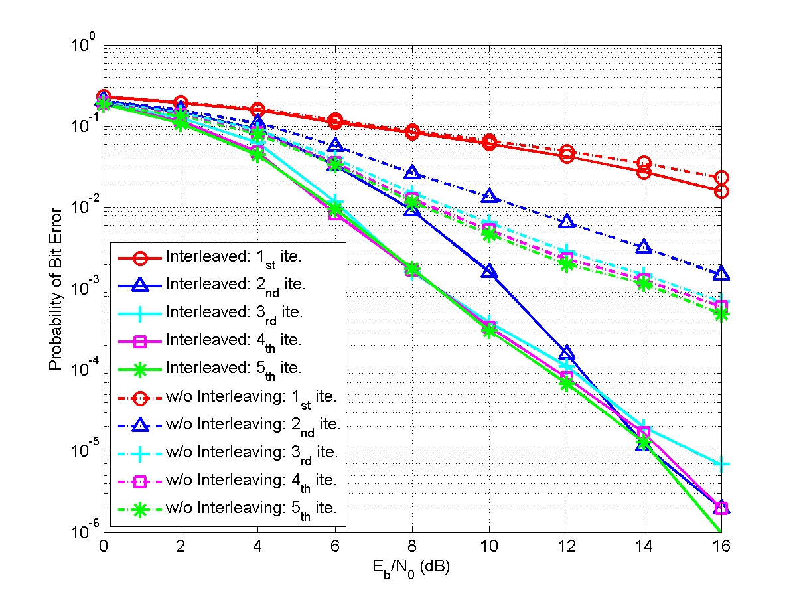

## IEEE Transactions on Wireless Comunications
### A Novel Message Passing Based MIMO-OFDM Data Detector with a Progressive Parallel ICI Canceller

A joint design of message passing MIMO data detector/decoder with progressive parallel inter-carrier interference canceller (PPIC) based on factor graph for OFDM-based wireless communication systems is proposed. By exchanging messages both in space domain and frequency domain, the proposed algorithm can suppress inter-antenna interferences and cancel inter-carrier interferences iteratively and progressively. With a proper designed message passing schedule and random interleaver, the short cycle problem is solved. Computer simulations show that the performance of the proposed message passing MIMO detector outperforms MMSE-SIC MIMO detector. The performances of PPIC, both in perfect channel estimation and imperfect channel estimation cases, are compared with the standard PIC architecture and the ICI self-canceller. The proposed PPIC is superior to PIC both in computational complexity and system architecture. The parallel structure of PPIC is similar to a systolic array. The proposed algorithm potentially leads to a very-high-speed detector/decoder. It is very suitable for VLSI implementation and it is a potential candidate for data detection/decoding in future high data rate, high mobility, wireless MIMO-OFDM communication systems.

#### Bit-based Message Passing Algorithm

* Sum Product Rule
* Max Product Rule
* MIMO Detector with progressive parallel ICI cancellation over multipath Rayleigh fading channel
* MAP MIMO detector and MMSE MIMO detector
* EXIT chart (EXtrinsic Information Transfer chart) analysis
* [EXIT chart](https://en.wikipedia.org/wiki/EXIT_chart)

#### Performance Evaluation

#### See also

* [IEEE Transactions on Wireless Communications](https://ieeexplore.ieee.org/abstract/document/5719528)
* [https://scholar.google.com/: US8331477B2](https://patents.google.com/patent/US8331477B2/en)
